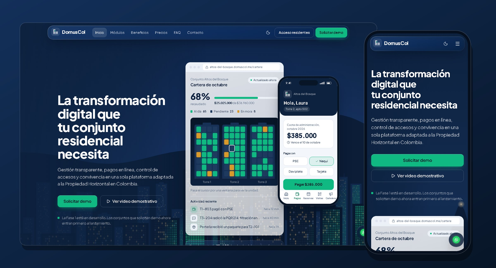
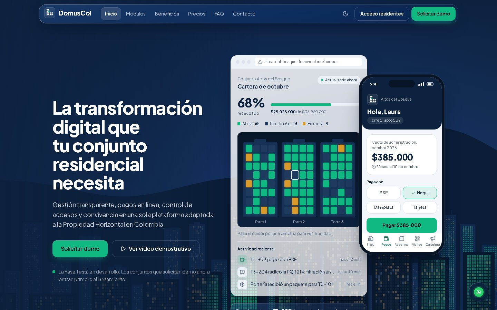
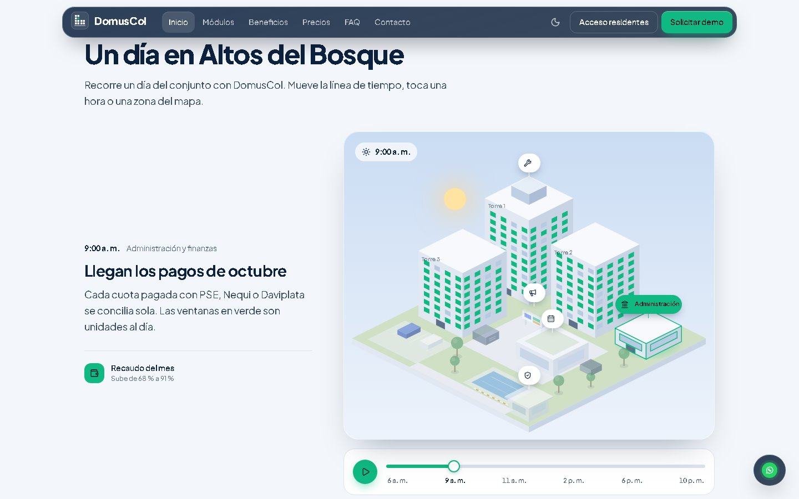
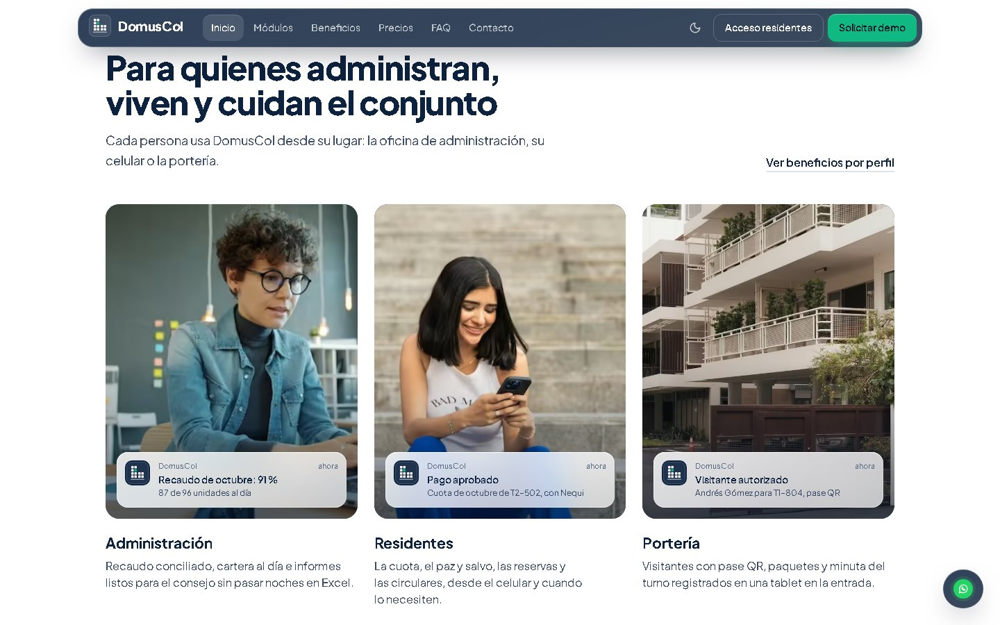
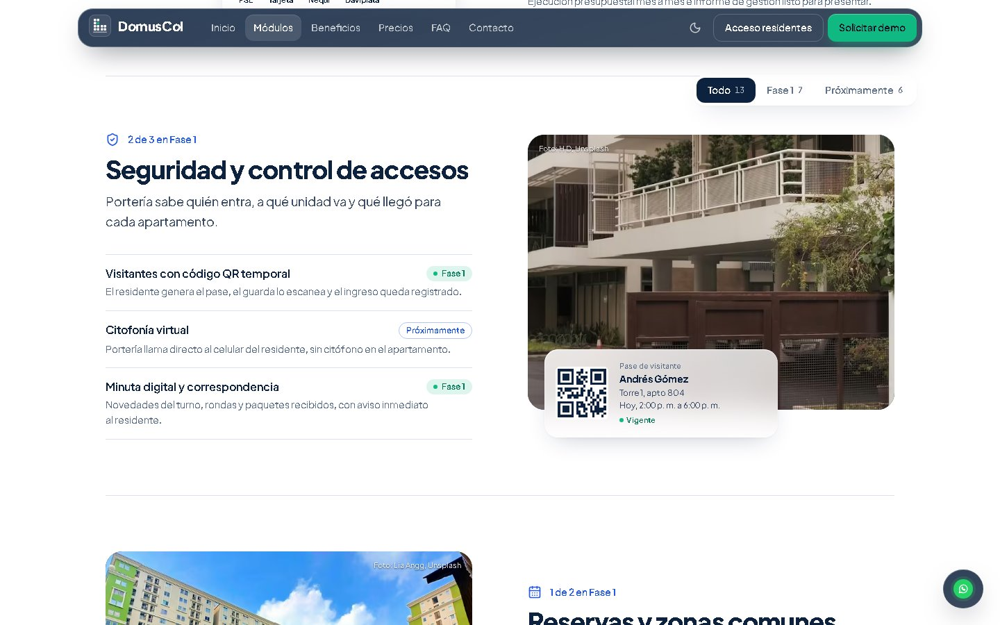
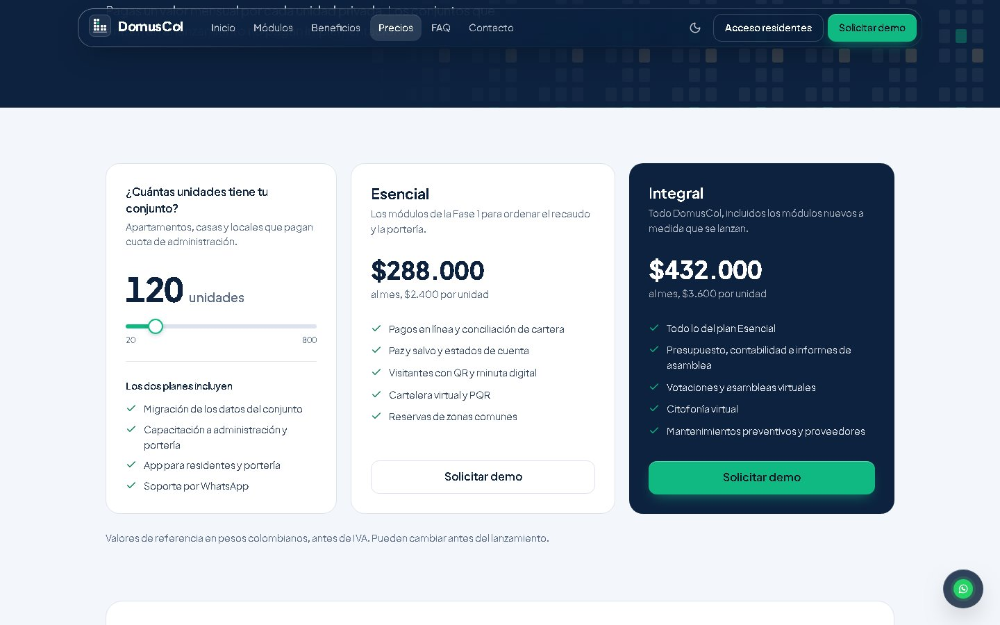
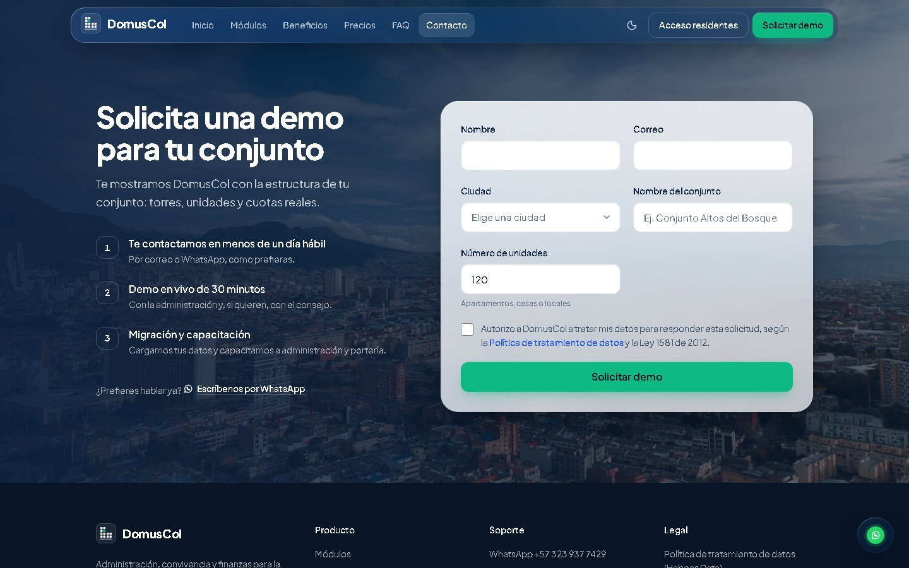
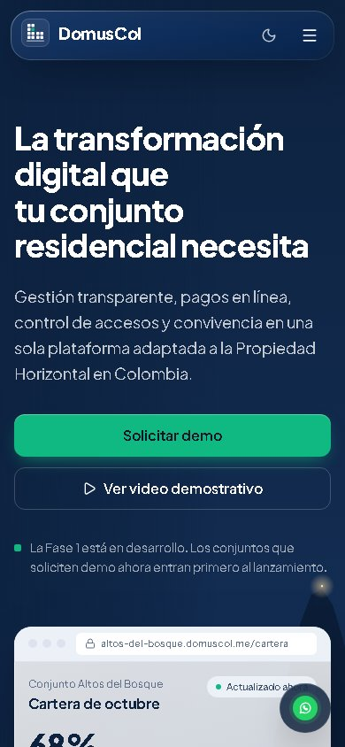
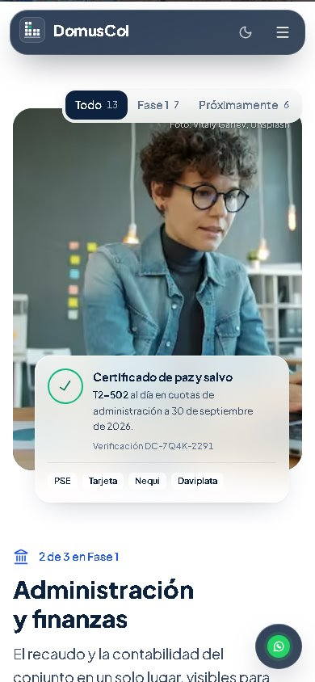
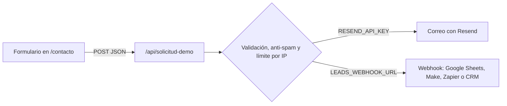

<p align="center">
  
</p>

<h1 align="center">DomusCol</h1>

<p align="center">
  <strong>El sitio público de la plataforma para administrar conjuntos residenciales en Colombia.</strong><br />
  Recaudo, portería, reservas y convivencia en un solo lugar, hecho para la Ley 675.
</p>

<p align="center">
  
  
  
  
  
</p>

<p align="center">
  <a href="https://domuscol.me"><strong>domuscol.me</strong></a>
  &nbsp;&nbsp;|&nbsp;&nbsp;
  <a href="https://domuscol.me/contacto">Solicitar demo</a>
  &nbsp;&nbsp;|&nbsp;&nbsp;
  <a href="#despliegue">Desplegar</a>
</p>

---

## ✨ Qué hay adentro

- **Una demo que se toca en el hero.** La fachada del conjunto es la cartera: cada ventana es una unidad. El visitante paga la cuota desde el celular de ejemplo y ve encenderse su ventana en el panel del administrador.
- **Bogotá de noche, generada en código.** Los cerros orientales, la luz de Monserrate y torres cuyas ventanas se encienden en esmeralda al pasar el cursor.
- **Un día en el conjunto.** Una escena isométrica que va de las 6 a. m. a las 10 p. m. con una línea de tiempo; cada hora muestra un módulo trabajando donde ocurre.
- **Lugares reales, pantallas reales.** Fotos de la vida en conjunto con la pantalla de DomusCol encima en *liquid glass*: paz y salvo, pase QR, reservas, votaciones y mantenimientos.
- **Precios y ahorro.** Simulador por número de unidades y calculadora de horas ahorradas, con los supuestos a la vista.
- **Formulario que sí llega.** Validación en navegador y servidor, protección anti-spam y entrega por correo (Resend) y/o webhook.
- **Listo para producción.** Modo claro y oscuro, accesible con teclado, respeta la preferencia de movimiento reducido, SEO por página, imagen para compartir, sitemap, datos estructurados y cabeceras de seguridad.

## 📸 Vista previa

<table>
  <tr>
    <td width="50%"><p align="center"><sub>Inicio: la fachada es la cartera</sub></p></td>
    <td width="50%"><p align="center"><sub>Un día en el conjunto</sub></p></td>
  </tr>
  <tr>
    <td><p align="center"><sub>Para quienes administran, viven y cuidan el conjunto</sub></p></td>
    <td><p align="center"><sub>Módulos por capítulos</sub></p></td>
  </tr>
  <tr>
    <td><p align="center"><sub>Precios por unidad</sub></p></td>
    <td><p align="center"><sub>Solicitud de demo</sub></p></td>
  </tr>
</table>

<p align="center">
  
  &nbsp;&nbsp;
  
</p>

## 🧱 Stack

| Capa | Tecnología |
| --- | --- |
| Framework | [Next.js 14](https://nextjs.org) con App Router, páginas estáticas y un endpoint de servidor |
| UI | React 18, TypeScript 5, Tailwind CSS 3.4 con tokens en variables CSS |
| Íconos y tipografía | [lucide-react](https://lucide.dev), Plus Jakarta Sans (la misma del panel `web-admin`) |
| Imágenes | `next/image` (AVIF y WebP) e imágenes generadas con `next/og` |
| Formulario | Route handler propio, [Resend](https://resend.com) y/o webhook |
| Hosting | [Vercel](https://vercel.com) |

El producto (API NestJS y panel `web-admin`) vive en el repositorio `domuscol-app`; esta landing comparte su marca: Azul Domus `#0D223F`, esmeralda `#10B981` y Plus Jakarta Sans.

## 🚀 Empezar

Necesitas Node.js 20.9 o superior y pnpm 12 (viene con Corepack).

```bash
corepack enable
pnpm install
cp .env.example .env.local
pnpm dev
```

Abre [http://localhost:3100](http://localhost:3100). En desarrollo, si no configuras un canal para el formulario, las solicitudes solo se registran en la consola.

| Comando | Qué hace |
| --- | --- |
| `pnpm dev` | Servidor de desarrollo en el puerto 3100 |
| `pnpm build` | Build de producción |
| `pnpm start` | Sirve el build en el puerto 3100 |
| `pnpm lint` | ESLint con las reglas de Next |
| `pnpm typecheck` | Verificación de tipos de TypeScript |
| `pnpm check` | Tipos, lint y build de una vez: úsalo antes de subir cambios |

## 🔐 Variables de entorno

Todas están documentadas en [`.env.example`](.env.example). Las que empiezan por `NEXT_PUBLIC_` llegan al navegador; nunca pongas secretos en ellas.

| Variable | Para qué sirve | Ejemplo |
| --- | --- | --- |
| `NEXT_PUBLIC_SITE_URL` | URL canónica: sitemap, SEO e imagen para compartir | `https://domuscol.me` |
| `NEXT_PUBLIC_RESIDENTS_URL` | Botón "Acceso residentes" | `https://app.domuscol.me/login` |
| `NEXT_PUBLIC_WHATSAPP_NUMBER` | Número de WhatsApp, solo dígitos con el 57 | `573239377429` |
| `NEXT_PUBLIC_WHATSAPP_LABEL` | Cómo se muestra el número | `+57 323 937 7429` |
| `NEXT_PUBLIC_SUPPORT_EMAIL` | Correo de soporte técnico | `soporte@domuscol.me` |
| `NEXT_PUBLIC_SALES_EMAIL` | Correo comercial | `ventas@domuscol.me` |
| `RESEND_API_KEY` | Activa el envío de solicitudes por correo | `re_...` |
| `LEADS_EMAIL_TO` | Destinatarios, separados por coma | `ventas@domuscol.me` |
| `LEADS_EMAIL_FROM` | Remitente (dominio verificado en Resend) | `DomusCol <solicitudes@domuscol.me>` |
| `LEADS_WEBHOOK_URL` | Activa el envío a un webhook | `https://hook.make.com/...` |
| `LEADS_WEBHOOK_SECRET` | Opcional, llega como `Authorization: Bearer` | `una-clave-larga` |

## 📬 Formulario de demo



- **Validación compartida.** Las mismas reglas corren en el navegador (respuesta inmediata) y en el servidor ([`src/lib/demo-request.ts`](src/lib/demo-request.ts)).
- **Anti-spam.** Un campo oculto que solo llenan los bots y un límite de 5 solicitudes por IP cada 10 minutos.
- **Varios canales.** Si configuras correo y webhook, se usan los dos; basta con que uno funcione para confirmar al visitante.
- **Nunca se pierde en silencio.** Sin canales configurados, producción responde con error y el formulario ofrece WhatsApp con un mensaje ya escrito.
- **Respuestas con el mismo formato de la API del producto:** `{ success, data?, error? }`.

<details>
<summary><strong>Configurar el correo con Resend</strong></summary>

1. Crea una cuenta en [resend.com](https://resend.com) y una API key.
2. En **Domains**, agrega `domuscol.me` y crea en tu DNS los registros que te indique (SPF y DKIM).
3. Define `RESEND_API_KEY`, `LEADS_EMAIL_TO` y `LEADS_EMAIL_FROM`.
4. Para probar antes de verificar el dominio, usa `LEADS_EMAIL_FROM="DomusCol <onboarding@resend.dev>"` (solo envía a tu propio correo de Resend).

Cada solicitud llega con asunto *"Solicitud de demo: {conjunto} ({unidades} unidades, {ciudad})"*, y al responder el correo le escribes directamente a quien la envió.

</details>

<details>
<summary><strong>Qué recibe el webhook</strong></summary>

```json
{
  "evento": "solicitud_demo",
  "recibida": "28/9/2026, 12:43:02 p. m.",
  "origen": "https://domuscol.me/contacto",
  "nombre": "Laura Gómez",
  "correo": "laura@ejemplo.com",
  "ciudad": "Medellín",
  "conjunto": "Conjunto Altos del Bosque",
  "unidades": 120,
  "autorizacion_datos": true
}
```

</details>

<details>
<summary><strong>Guardar las solicitudes en Google Sheets</strong></summary>

1. Crea una hoja llamada `Solicitudes` y abre **Extensiones > Apps Script**.
2. Pega este código y publícalo en **Implementar > Nueva implementación > Aplicación web**, con acceso para "Cualquier usuario".

```js
function doPost(e) {
  // Apps Script no expone las cabeceras: usa ?token= en la URL como clave.
  if (e.parameter.token !== "CAMBIA-ESTA-CLAVE") {
    return ContentService.createTextOutput("forbidden");
  }
  const d = JSON.parse(e.postData.contents);
  SpreadsheetApp.getActiveSpreadsheet()
    .getSheetByName("Solicitudes")
    .appendRow([d.recibida, d.nombre, d.correo, d.ciudad, d.conjunto, d.unidades]);
  return ContentService.createTextOutput(JSON.stringify({ ok: true }))
    .setMimeType(ContentService.MimeType.JSON);
}
```

3. Usa como `LEADS_WEBHOOK_URL` la URL de la aplicación web con `?token=CAMBIA-ESTA-CLAVE` al final, y deja `LEADS_WEBHOOK_SECRET` vacío.

</details>

<a id="despliegue"></a>

## ☁️ Despliegue en Vercel

1. **Sube el código** a GitHub (`MiguelAHz2/domuscol-page`, rama `main`).
2. En Vercel, **Add New > Project** e importa el repositorio. Vercel detecta Next.js; no cambies los comandos de build ni la carpeta raíz.
3. En **Environment Variables**, agrega las de la tabla anterior para *Production* y también:
   - `ENABLE_EXPERIMENTAL_COREPACK=1`, para que Vercel use la versión de pnpm fijada en `packageManager`.
4. **Deploy.** Cada pull request tendrá su URL de vista previa, que no se indexa en buscadores (el `robots.txt` lo decide según `VERCEL_ENV`).
5. **Dominio:** en *Settings > Domains* agrega `domuscol.me` y `www.domuscol.me` (con redirección de `www` al dominio principal).
6. **DNS** en tu registrador, con los valores exactos que te muestre Vercel. Normalmente son:

   | Tipo | Nombre | Valor |
   | --- | --- | --- |
   | `A` | `@` | `76.76.21.21` |
   | `CNAME` | `www` | `cname.vercel-dns.com` |

   El certificado HTTPS se emite solo cuando el DNS propaga.

## ✅ Antes de lanzar

- [ ] Variables de producción cargadas en Vercel (contacto, Resend y/o webhook)
- [ ] Dominio verificado en Resend y una solicitud de prueba recibida
- [ ] Textos legales reales en `/legal/*` (hoy son un aviso de "documento en preparación")
- [ ] Redes sociales reales en [`src/components/layout/footer.tsx`](src/components/layout/footer.tsx)
- [ ] Precios confirmados en [`src/lib/data/pricing.ts`](src/lib/data/pricing.ts)
- [ ] Fases y tiempos de la hoja de ruta en [`src/lib/data/roadmap.ts`](src/lib/data/roadmap.ts)
- [ ] Supuestos de la calculadora de ahorro en [`src/components/sections/savings-calculator.tsx`](src/components/sections/savings-calculator.tsx)
- [ ] Sitio y `sitemap.xml` registrados en Google Search Console
- [ ] Vista previa del enlace revisada al compartirlo por WhatsApp
- [ ] (Opcional) Analítica con banner de consentimiento, por la Ley 1581

## 🗂️ Estructura

<details>
<summary>Ver el árbol del proyecto</summary>

```text
src/
├─ app/
│  ├─ (site)/                 Páginas con navbar, footer y botón de WhatsApp
│  │  ├─ page.tsx             Inicio
│  │  ├─ modulos/             Módulos por capítulos y hoja de ruta
│  │  ├─ beneficios/          Beneficios por perfil
│  │  ├─ precios/             Simulador, planes y calculadora de ahorro
│  │  ├─ preguntas-frecuentes/
│  │  ├─ contacto/            Formulario de demo
│  │  └─ legal/[slug]/        Textos legales (por completar)
│  ├─ api/solicitud-demo/     Recibe y entrega las solicitudes
│  ├─ opengraph-image.tsx     Imagen para compartir en redes
│  ├─ apple-icon.tsx          Ícono para la pantalla de inicio del celular
│  ├─ manifest.ts, robots.ts, sitemap.ts
│  └─ globals.css             Tokens de color, liquid glass y movimiento
├─ assets/images/             Fotografías (ver créditos)
├─ components/
│  ├─ hero/                   Fachada, panel, celular y skyline
│  ├─ day/                    Escena isométrica del conjunto
│  ├─ sections/               Secciones de cada página
│  ├─ layout/                 Navbar, footer, encabezados y cierre
│  └─ ui/                     Botones, insignias, efectos de vidrio
└─ lib/
   ├─ data/                   Contenido: módulos, precios, FAQ, perfiles, día
   ├─ demo-request.ts         Reglas del formulario (cliente y servidor)
   └─ site.ts                 Datos del sitio y enlaces de contacto
```

</details>

## 🎨 Diseño

| Token | Color | Uso |
| --- | --- | --- |
| Azul Domus | `#0D223F` | Color dominante: hero, navbar, franjas y texto |
| Esmeralda | `#10B981` | Solo para "al día", aprobado y acciones principales |
| Cobalto | `#2458E6` | Enlaces, foco y estados "próximamente" |
| Niebla | `#F3F6FA` | Fondo de las secciones claras |

- **Una sola familia tipográfica:** Plus Jakarta Sans, en una escala clásica (12, 14, 16, 18, 21, 24, 36, 48, 60).
- **El vidrio va sobre algo real.** El *liquid glass* se usa solo sobre fotos, el skyline o contenido que pasa por debajo (navbar, notificaciones, formulario). Las secciones planas usan superficies sólidas y líneas finas.
- **El contenido está separado del diseño:** textos, módulos, precios y preguntas viven en `src/lib/data`, y los datos de contacto en `src/lib/site.ts`.
- **Accesible:** navegación completa con teclado, foco visible, etiquetas ARIA en pestañas, acordeones y filtros, y movimiento reducido cuando el sistema lo pide.

## 📷 Créditos de fotos

Fotografías de [Unsplash](https://unsplash.com), usadas bajo su licencia:

| Foto | Autor |
| --- | --- |
| [Torre de ladrillo en Bogotá](https://unsplash.com/photos/cfL-2MtZZLw) | Victor Rosario |
| [Bogotá y los cerros orientales](https://unsplash.com/photos/mxndYWsYyjU) | Victor Rosario |
| [Administradora en su oficina](https://unsplash.com/photos/WrlIRaC9t-A) | Vitaly Gariev |
| [Residente con su celular](https://unsplash.com/photos/zCsk_Jv2NNE) | Julio López |
| [Acceso de un edificio residencial](https://unsplash.com/photos/pOkh5fhNGZI) (recortada) | H D |
| [Piscina entre torres](https://unsplash.com/photos/QnJNgeV5Bpg) | Lia Angg |
| [Mantenimiento eléctrico](https://unsplash.com/photos/LMb98OOtoYU) | colsan ltda |
| [Torres al anochecer](https://unsplash.com/photos/OflP2eE5pnU) | Eugene Chystiakov |

## 📄 Licencia

Código privado. © 2026 DomusCol. Todos los derechos reservados.

<p align="center"><sub>Hecho en Colombia para la propiedad horizontal colombiana.</sub></p>
